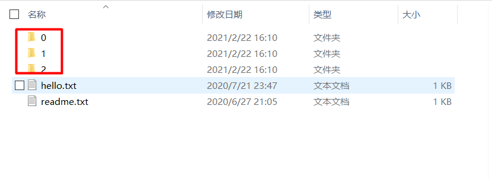

# HomeMenu
Show the menu in the order screen

## Introduce

- This is a Java swing project.

- The code is packed in a packet named 'menu.jar'.(Pack the folder [menu](./menu) and then get the 'menu.jar')

- The resources were in a folder named [pic](./pic).
- In the folder [pic](./pic),there use a [hello.txt](./pic/hello.txt) to save the status of the picture to demonstrate which pictures to show.

## Usage

- The main windows show 3x4 pictures,and you can change the pattern by change the **gridrow** and **gridCol** in the **class Win**. **And then compile the the jar once again,then you can use it**.

- If you want to change the pictures for show,you can change the pictures in the sub-folder of the folder [pic](./pic).

  